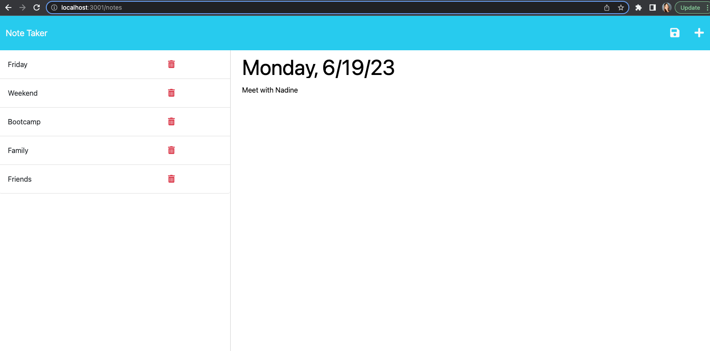

# Note Taker
> This is an application called Note Taker which can be used to write, save, and delete notes.  It uses a Express.js back end and will save and retrieve note data from a JSON file.
> Live demo [_here_](https://limitless-beach-25576-c67f229a6c21.herokuapp.com/). <!-- If you have the project hosted somewhere, include the link here. -->

## Table of Contents
* [General Info](#general-information)
* [Technologies Used](#technologies-used)
* [Features](#features)
* [Screenshots](#screenshots)
* [Setup](#setup)
* [Usage](#usage)
* [Project Status](#project-status)
* [Room for Improvement](#room-for-improvement)
* [Acknowledgements](#acknowledgements)
* [Contact](#contact)
<!-- * [License](#license) -->

## General Information
In this note-taking application, the user is presented with a landing page with a "Get Started" link to the notes page.  When the user click on the link to the notes page, a page with existing notes is listend in the left-hand column, plus empty filds to enter a new note title and the note's text in the right-hand column.  A Save icon will appear in the navigation at the top of the page when the user enters a new note title and the note's text.  When the save button is clicked, the new note is saved and appears in the left-hand column with the other existing notes.  When an existing note in the list is clicked in the left-hand column, it appears in the right-hand column.  The user can click on the Write icon (plus sign) in the navigation at the top of the page to enter a new note title and the note's text in the right-hand column.  When a note needs to be deleted, click the trash can icon next to the existing note.
<!-- You don't have to answer all the questions - just the ones relevant to your project. -->

## Technologies Used
- Node.js
- Express ^4.16.4
- uuid ^8.3.2

## Features
- Create a note's title and note text in the right-hand column.
- Save icon will save the title and text in the left-hand column.
- Note can be deleted by clicking the trash can icon.
- Click on an existing note to display the title and text in the right-hand column.
- Click the Write icon (plus sign) to enter a new note title and text.

## Screenshots

<!-- If you have screenshots you'd like to share, include them here. -->

## Setup
The following are required to run this project:
- Node.js 
- Express.js
- Node package modules
- File System module 

## Usage
`npm i`

`npm run start` or `node server.js`

## Project Status
Project is: _complete_.

## Acknowledgements
- Many thanks to my instructor, Michael Pacheco, the TAs, Nirav and Julius, the tutor Dane Shrewsbury, and all the AskBCS learning assistants.
- In class activities used to guide me through this project, specifically the module 11 Express Mini-project.

## Contact
Created by Kristine Kim.  Feel free to contact me at kristinehkim@gmail.com!

<!-- Optional -->
## License
- ISC 
<!-- This project is open source and available under the [... License](). -->

<!-- You don't have to include all sections - just the one's relevant to your project -->